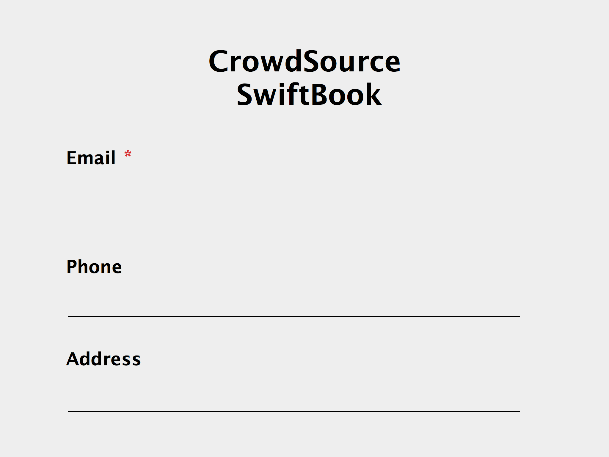

# Optionals

What are optionals? Actually, you already know about it. Take a look at this :



This is the one of a typical registration form you can encounter in many websites. In the above example, you can notice `Email address` field has a red asterisk `*`, which indicates a mandatory element. On the other hand, `Phone` and `Website` are **optional** fields. So, you can put your information or keep the empty in these fields. And that's what optionals do in Swift.

How to implement the optional field of the example with Swift? Fortunately, Swift provides optionals to cope with the absence of value. An optional type is defined as an [`enumeration`](enumerations.md) in the Swift standard library :

```swift
enum Optional<Wrapped> {
    case Some(Wrapped)
    case None
}
```

There are two cases in the above enumeration : Some and None. So, you can assign some value or set no value in the instance of an optional type. `<Wrapped>` means that it is [`generic type`](generics.md). Therefore, you can use optionals with any type. An actual optional type will be determined when an optional variable or constant is declared.

In order to access a value which contains in an instance of an optional type, you can use `safely unwrapping` or `forced unwrapping`. Recall how the optional enumeration is. Because a value is `wrapped` in the `Optional` enumeration, we need to take `unwrap` process.


## Syntax

Here is a simple way of creating an optional type :

```swift
let cityOne: Optional<String> = "Stockholm" // 1
let cityTwo: String? = "Stockholm" // 2
let cityThree: String? = Optional.Some("Stockholm") // 3
let cityFour = Optional.Some("Stockholm") // 4
```

They are equivalent. Instead of `Optional<Wrapped>`, you can use `?` to make simple syntax expression. It's the most preferred way to create the optional type.

Also, you can have no value using the optional type :

```swift
let cityFive: String? = Optional.None
let citySeven : String? = nil
let cityEight: String?
```

If you declare an optional variable, constant or property without an initial value, it has an default value, `nil`.

## Safely Unwrapping

TODO: tell the reader how they can use the `guard` or `if let` to safely unwrap values inside optionals

## Force Unwrapping

TODO: talk about `!` and how it is useful sometimes and how it can be dangerous

## Switching

TODO: explain how we can use the `switch` statement to find out what value is inside an optional. A custom `apply()` function on an extension to `Optional` comes to mind
