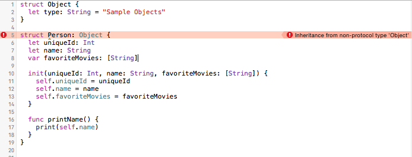

# Structures

Structures and Classes make up the building blocks of your code. Lets start by looking at Structures, their syntax and general purpose. We will do this by going through a simple example, building our own Structure from the ground up. We will also highlight how Structures are like Classes and what makes them different

In Swift, defining a new Structure is simple. 

## [Syntax](#syntax)

````Swift
struct Person {
  
}
````
Structures, much like Classes can have properties that will store values.

````Swift
struct Person {
  var name: String = "John Doe"
}
````
They can also have methods that add functionality to the Structure.

````Swift
struct Person {
  var name: String = "John Doe"

  func printName() {
    print(self.name)
  }
}
````
Like Classes, Structures can also have initializers that set up their initial state.

````Swift
struct Person {
  var name: String = "John Doe"
  var favoriteMovies: [String]
  
  init(favoriteMovies: [String])
  {
    self.favoriteMovies = favoriteMovies
  }
  
  func printName() {
    print(self.name)
  }
}
````
In Swift, Structures like classes can also be extended. Assuming the structure defined aboved exists somewhere in our project we can extend its functionality, just as we can in Classes somewhere else in our code 

````Swift
extension Person {
  func printFavoriteMovies() {
    for movie in favoriteMovies {
      print(movie)
    }
  }
}
````

Structures, like Classes can conform to protocols.

````Swift
protocol NameReversible {
  func printNameInReverse()
}

struct Person: NameReversible {
  var name: String = "John Doe"
  var favoriteMovies: [String]

  init(favoriteMovies: [String]) {
    self.favoriteMovies = favoriteMovies
  }

  func printName() {
    print(self.name)
  }
  
  func printNameInReverse() {
    print(String(self.name.characters.reverse()))
  }
}
````

There is no difference between protocols used by structures or classes. For example the Hashable and Equtable protocols which are standard Swift protocols can be used on either a Class or a Structure. 

````Swift
struct Person: Hashable, Equatable {
  let uniqueId: Int
  let name: String
  var favoriteMovies: [String]

  init(uniqueId: Int, name: String, favoriteMovies: [String]) {
    self.uniqueId = uniqueId
    self.name = name
    self.favoriteMovies = favoriteMovies
  }

  func printName() {
    print(self.name)
  }
  
  var hashValue: Int {
    return self.uniqueId
  }
}

func ==(lhs: Person, rhs: Person) -> Bool {
  return lhs.uniqueId == rhs.uniqueId
}
````

Once the structure is defined it can be instantiated like class.

````Swift
var joe = Person(uniqueId: 1, name: "Joe Example", favoriteMovies: ["Titanic", "Star Wars"])

var jane = Person(uniqueId: 1, name: "Jane Example", favoriteMovies: ["ET", "Avatar"])
````

Once instantiated, you access the properties and call the methods within a Strucuture much like a class instance.

````Swift
let jane = Person(uniqueId: 1, name: "Jane Example", favoriteMovies: ["ET", "Avatar"])
let joe = Person(uniqueId: 1, name: "Joe Example", favoriteMovies: ["Titanic", "Star Wars"])

joe.printName()
jane.printFavoriteMovies()
````
The code above will output
````
Joe Example
ET
Avatar
````

## [Versus Classes](#versus-classes)

Now that we know how to build Structures and how they are similar to Classes, lets go over what makes them different. 

**Structures cannot inherit from other structures or classes.** We will go over how we use inheritance to extend the functionalities of specific classes. But for now, remember that Structures are incapable of inheritance. This means they cannot extend any other class or structure or be extending by any other class or structures.



**Strucutures cannot be type casted or downcasted** Typecasting is used check class's type or cast it as another type within its inheritance hierarchy.  TODO: is it because struct are value types and classes are reference types and data types lack a type definiton once memory is allocated for them? need better understanding of this

**Structures cannot use the `deinit` keyword to deallocate resources assigned**
**Structures cannot have multiple references to the same isntance**

and perhaps more importantly Structures are value types and Classes are reference types.

TODO: Do example


